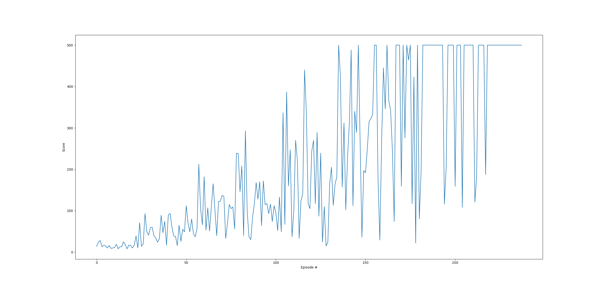
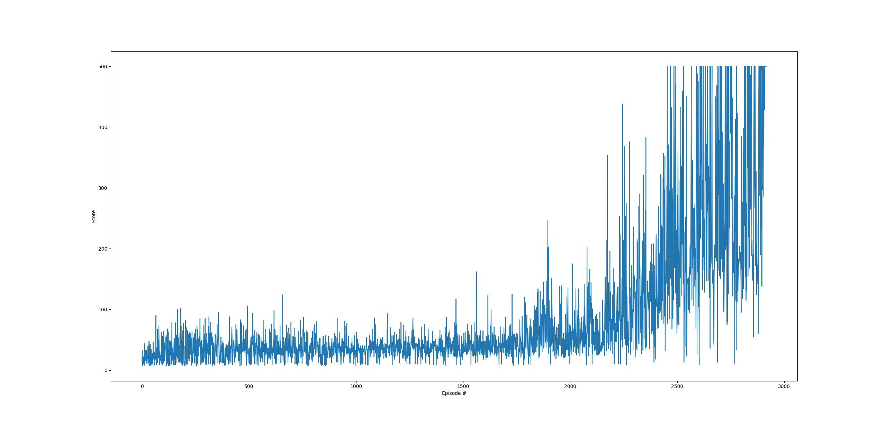
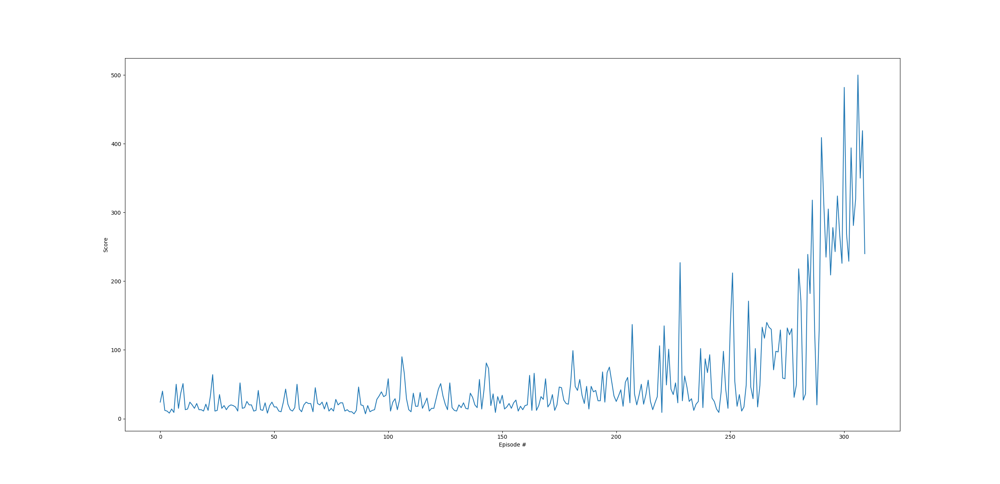
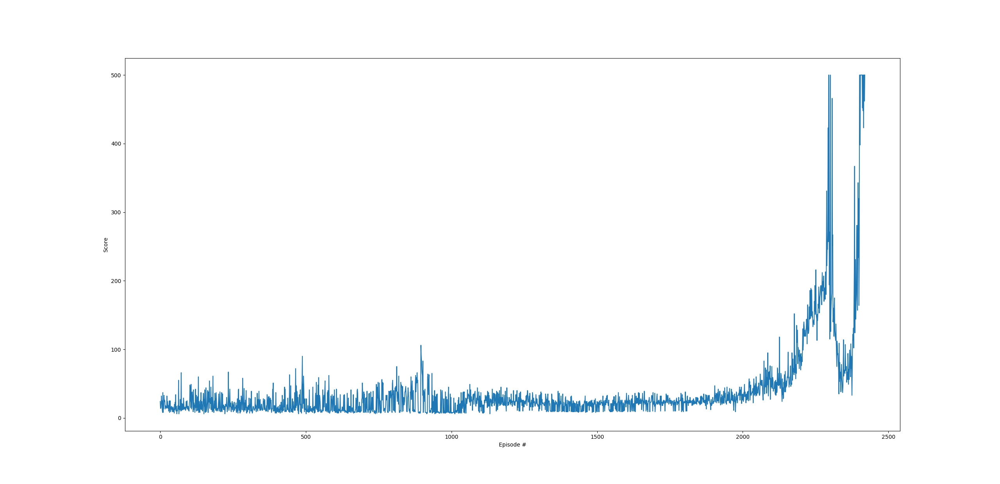
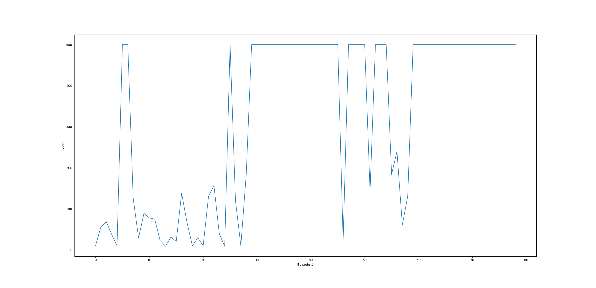
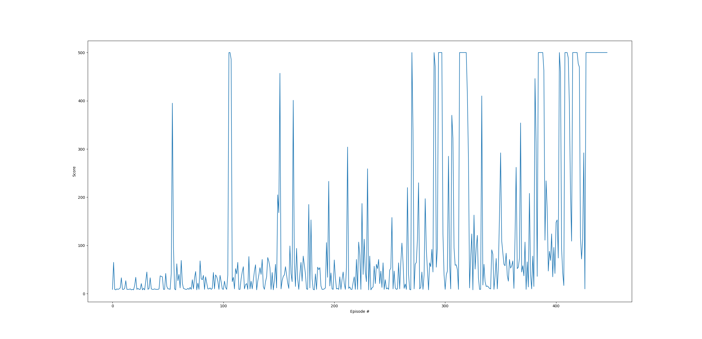
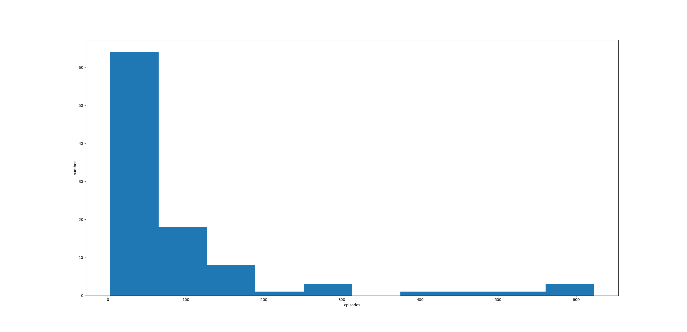

# RL CartPole-v1

## 依赖

- matplotlib  
- pytorch  
- gym  
- numpy

## 运行

对任务1直接运行代码即可：
```
python ppo.py
```

对任务2需要将代码中`is_reducce_ob`改为`True`，然后运行：
```
python ppo.py
```

## 算法

### PPO

#### 任务1



#### 任务2



### DQN

#### 任务1



#### 任务2



### Hill Climbing

#### 任务1



#### 任务2



## 结果

**参数调整：** 所有的算法的超参数都选择的是该算法最常用的值。

**输入特征：** 对于任务1，输入特征为当前状态（4个值）。 对于任务2，输入为前一个状态与当前状态（4个值）。
对任务3输入仅为当前状态（2个值）。

**结果评估：** 对于任务1，PPO与DQN的表现相仿，都能在尝试200-300次后解决问题；HC略快，只需要
30-60次左右。 对于任务2，PPO与DQN大致需要接近2500-3000次尝试；HC则仅仅需要几十到几百次。 所以
从实验结果来看对于CartPole这种相对简单的问题，HC的结果更好一些。 但是三种算法都无法解决任务3。

HC任务1结果分布（100次）


*其余任务运行时间较久所以结果分布分析略过*